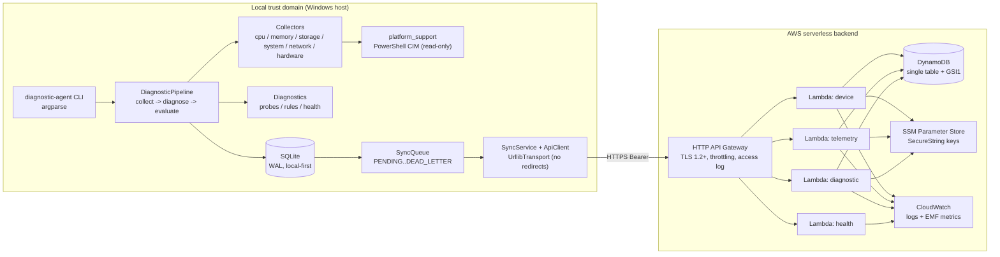

# Local-to-Cloud Diagnostic Gateway

> Documentation language: English (this file) · [Português (Brasil)](README.pt-BR.md)

A Windows-first Python diagnostic agent that collects hardware, operating
system, storage and network telemetry, evaluates deterministic health rules
locally, persists every run in SQLite, and keeps working with no internet.
Selected, minimized telemetry is queued locally and synchronized to an AWS
serverless backend (HTTP API Gateway → Lambda → single-table DynamoDB) with a
bounded, backoff-driven retry policy.

## Problem statement

Diagnosing a machine that is itself having connectivity problems is awkward: a
cloud-only agent stops being useful exactly when the network degrades. Running
diagnostics should never depend on the cloud, and uploading results should never
risk losing data during an outage or leaking personal information off the host.

## Why this project exists

This is a portfolio project that demonstrates edge-first design against a
serverless backend: local diagnostics that are fully functional offline, a
durable sync queue that survives long outages without losing or duplicating
events, idempotent cloud ingestion, least-privilege IAM, and offline-verifiable
infrastructure. It favors the Python standard library and a single third-party
runtime dependency (`psutil`) so the moving parts stay few and reviewable.

## Architecture diagram



More diagrams: the [data-flow](diagrams/data-flow.mmd) and
[sync state machine](diagrams/sync-state-machine.mmd) sources live under
`diagrams/`, embedded in [docs/architecture.md](docs/architecture.md).

## Technology stack

| Concern | Choice | Version |
|---|---|---|
| Language | Python | agent ≥ 3.11 (dev 3.14.6); Lambda `python3.13`, `arm64` |
| System metrics | `psutil` | 7.2.2 |
| HTTP client | `urllib.request` (stdlib) | — |
| CLI | `argparse` (stdlib) | — |
| Local DB | `sqlite3` (stdlib), WAL mode | — |
| Cloud SDK | `boto3` (Lambda runtime; pinned for dev) | 1.43.106 |
| Tests | `pytest`, `pytest-cov`, `moto[dynamodb,ssm]` | 9.1.1, 7.1.0, 5.2.3 |
| Lint / types | `ruff`, `mypy` | 0.16.9, 2.3.1 |
| IaC | AWS SAM, validated with `cfn-lint` | cfn-lint 1.57.1 |
| Build backend | `setuptools` | 84.0.0 |
| AWS services | HTTP API Gateway, Lambda, DynamoDB, CloudWatch, SSM | — |

`psutil` replaces a large amount of ctypes/WMI code and ships Windows wheels.
`urllib` is preferred over `requests` because the agent makes one kind of call
(JSON over HTTPS with a timeout), stdlib verifies TLS certificates by default,
and it avoids extra transitive packages. Cloud code uses only the standard
library plus the runtime's `boto3`, so the Lambda bundle carries no third-party
packages and needs no layer. There is no `pydantic`: validators in
`shared/schemas` are hand-written so both sides stay dependency-free and every
rule is explicit.

## Features

- Local-first diagnostics: `hardware`, `network` and `health` work with no
  network and no cloud configuration.
- Deterministic rule-based health evaluation (no LLM) with configurable
  thresholds.
- Network classification (HEALTHY / DEGRADED / UNSTABLE / OFFLINE / UNKNOWN)
  with evidence and possible causes, never a definitive root cause.
- Durable offline sync queue with a bounded, jittered backoff retry policy and a
  DEAD_LETTER state; events are never lost during an outage.
- Idempotent cloud ingestion keyed on `event_id` (exactly-once storage).
- Deterministic demo mode with six scenarios over simulated inputs.
- Structured JSON logs with secret redaction and EMF metrics in the cloud.
- Six deterministic demo scenarios, a read-only platform module, and
  least-privilege IAM (one role per function).

## Installation

The project uses a `src/` layout and must be installed to expose the console
script. On Windows PowerShell:

```powershell
py -m venv .venv
.\.venv\Scripts\Activate.ps1
pip install -r requirements-dev.txt -c constraints-dev.txt
pip install -e . --no-deps
```

The editable install (`pip install -e . --no-deps`) exposes the
`diagnostic-agent` console script; `python -m agent` behaves identically. This
is a documented adjustment of the original spec step (`pip install -r
requirements.txt`), which the `src/` layout makes necessary.

## Local execution

```powershell
diagnostic-agent --help
diagnostic-agent hardware         # CPU, memory, storage, system, GPU, disk health
diagnostic-agent network          # interfaces, gateway, DNS, probes, classification
diagnostic-agent health           # full pipeline, no database write
diagnostic-agent scan             # full pipeline, persists the run
diagnostic-agent scan --sync      # scan then one sync cycle
diagnostic-agent status           # identity, config summary, queue counts
diagnostic-agent queue stats      # queue counts per state
diagnostic-agent demo --all       # six deterministic scenarios
diagnostic-agent run              # scan + sync loop on the telemetry interval
diagnostic-agent menu             # interactive numbered menu; runs a command then returns to the menu
```

Copy `.env.example` to `.env` to configure cloud sync (both files are optional;
with no `.env` the agent runs fully local and sync is disabled).

## AWS deployment

Infrastructure is AWS SAM (`infrastructure/template.yaml`) and ships with
`scripts/deploy.{ps1,sh}`, `scripts/teardown.{ps1,sh}` and
`scripts/validate-infra.{ps1,sh}`. **Nothing in this repository deploys to AWS;**
deployment is a manual, documented step. Validation is offline only via
`cfn-lint` (the SAM CLI is not required to validate here). See
[docs/troubleshooting.md](docs/troubleshooting.md) for the deploy-time first
checks (KMS/SSM decrypt, `CodeUri: ../src` resolution, and the HTTP API
access-log service-linked-role permission).

## API documentation

The versioned `/v1` REST API plus an unauthenticated `/health` liveness route
are documented per endpoint (method, path, purpose, auth, request, response,
errors, curl) in [docs/api.md](docs/api.md).

## Security

Transport is HTTPS (TLS 1.2+). Authentication is a Bearer API key with two
scopes (`ingest`, `read`) stored as SSM SecureStrings; each Lambda has its own
least-privilege IAM role with no wildcard actions. Input is validated by the
shared schema the agent also pre-checks. See [docs/security.md](docs/security.md)
and the [threat model](docs/threat-model.md).

## Cost considerations

The backend is serverless and pay-per-use: on-demand DynamoDB, four small Lambda
functions, an HTTP API, CloudWatch logs with 14-day retention, and a handful of
EMF custom metrics. Conservative defaults (hourly telemetry, batches of up to 10
events, bounded batches per cycle, DynamoDB TTL on diagnostics) keep steady-state
cost low. See [docs/cost.md](docs/cost.md), which notes that EMF custom metrics
are billed per metric name × dimension per month.

## Privacy

The agent minimizes what it collects and uploads. It never collects browser
history, documents, keystrokes, screenshots, MAC addresses, hardware serial
numbers or user names. IP addresses, interface names and DNS servers are used
only in local diagnostics and are scrubbed from evidence before any upload (a
redactor replaces IP literals with `<ip>`). Physical-disk and GPU model strings
stay in local facts and never enter the cloud payload. One deliberate exception:
the API access log retains the caller's `sourceIp` as abuse evidence for a
stolen key; this is documented in [docs/security.md](docs/security.md).

## Testing

Everything is verified locally with no AWS account: unit tests, moto-backed
cloud integration tests, an end-to-end test of the agent sync client against the
real Lambda handlers over a local HTTP server, offline scenarios, infrastructure
assertions, and quality gates (import boundaries, secret-leak, diagram/ADR
structure).

```powershell
.\.venv\Scripts\python.exe -m ruff check
.\.venv\Scripts\python.exe -m mypy src
.\.venv\Scripts\python.exe -m pytest
.\.venv\Scripts\python.exe -m cfnlint infrastructure/template.yaml
```

See the test results in [docs/engineering-report.md](docs/engineering-report.md).

## Failure handling

The agent is designed to fail gracefully: collector or platform-query failures
mark a section unavailable and the run continues; being offline records an
`OFFLINE` attempt without consuming the retry budget; delivered-but-failed
requests back off and eventually DEAD_LETTER; redirects and unexpected statuses
are treated as configuration errors so the ingest key is never sent to another
host. The full failure matrix is in [docs/architecture.md](docs/architecture.md).

## Architecture decisions

Key decisions are recorded as ADRs under
[docs/decisions/](docs/decisions/): local-first design, a serverless backend,
DynamoDB, SQLite local storage, the offline sync queue, SAM for IaC, and API
authentication.

## Limitations

- Windows-only collectors (the architecture allows other platforms later).
- No per-device credentials or mTLS; a single shared ingest key.
- No web dashboard, alerting, or remote commands.
- Runs recorded while sync was disabled are local-only and are not back-filled.
- `sam validate` is not run here (the SAM CLI is not installed); IaC is checked
  with `cfn-lint`.

## Future improvements

Per-device credentials, a Lambda authorizer, a read dashboard, SNS/CloudWatch
alarms, Linux/macOS collectors, and point-in-time recovery for the table are
realistic next steps.

## Examples

`diagnostic-agent demo --all` prints six deterministic scenarios (HEALTHY,
DEGRADED_NETWORK, LOW_DISK, HIGH_MEMORY, DNS_FAILURE, OFFLINE_MODE) and is the
quickest way to see the report format without real hardware or a network.

## Documentation convention

Every human-facing document in this repository is delivered in two languages:
English in `<name>.md` and Brazilian Portuguese in the sibling `<name>.pt-BR.md`,
with equivalent content. Prose is translated; code, identifiers and code
comments stay in English. This applies to the README, every file under `docs/`,
and every ADR under `docs/decisions/`. The original specification file and the
`.agents/` directory are not part of the documentation set.

## AI usage note

AI tools were used as development assistants on this project. All generated code
and documentation were reviewed; dependencies are justified and pinned, no
hidden abstractions were introduced, and the engineering decisions are explained
in the docs and ADRs rather than left implicit.

## Author

Built by Airton. Licensed under the [MIT License](LICENSE).
