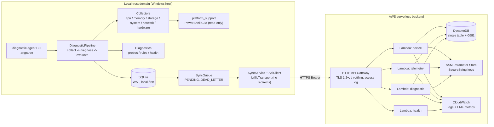

# Local-to-Cloud Diagnostic Gateway

> Idioma da documentação: Português (Brasil) (este arquivo) · [English](README.md)

Um agente de diagnóstico em Python, voltado primeiro ao Windows, que coleta
telemetria de hardware, sistema operacional, armazenamento e rede, avalia regras
determinísticas de saúde localmente, persiste cada execução em SQLite e continua
funcionando sem internet. A telemetria selecionada e minimizada é enfileirada
localmente e sincronizada com um backend serverless da AWS (HTTP API Gateway →
Lambda → DynamoDB de tabela única) com uma política de retentativa limitada e
baseada em backoff.

## Declaração do problema

Diagnosticar uma máquina que está ela mesma com problemas de conectividade é
complicado: um agente que depende da nuvem deixa de ser útil justamente quando a
rede piora. Rodar diagnósticos nunca deveria depender da nuvem, e enviar
resultados nunca deveria arriscar perder dados durante uma indisponibilidade ou
vazar informações pessoais do host.

## Por que este projeto existe

Este é um projeto de portfólio que demonstra um design "edge-first" contra um
backend serverless: diagnósticos locais totalmente funcionais offline, uma fila
de sincronização durável que sobrevive a longas quedas sem perder nem duplicar
eventos, ingestão idempotente na nuvem, IAM de menor privilégio e infraestrutura
validável offline. Ele privilegia a biblioteca padrão do Python e uma única
dependência de runtime de terceiros (`psutil`) para manter poucas peças móveis e
revisáveis.

## Diagrama de arquitetura



Mais diagramas: as fontes de [fluxo de dados](diagrams/data-flow.mmd) e da
[máquina de estados da sincronização](diagrams/sync-state-machine.mmd) ficam em
`diagrams/`, embutidas em [docs/architecture.pt-BR.md](docs/architecture.pt-BR.md).

## Pilha de tecnologia

| Preocupação | Escolha | Versão |
|---|---|---|
| Linguagem | Python | agente ≥ 3.11 (dev 3.14.6); Lambda `python3.13`, `arm64` |
| Métricas de sistema | `psutil` | 7.2.2 |
| Cliente HTTP | `urllib.request` (stdlib) | — |
| CLI | `argparse` (stdlib) | — |
| Banco local | `sqlite3` (stdlib), modo WAL | — |
| SDK da nuvem | `boto3` (runtime do Lambda; fixado para dev) | 1.43.106 |
| Testes | `pytest`, `pytest-cov`, `moto[dynamodb,ssm]` | 9.1.1, 7.1.0, 5.2.3 |
| Lint / tipos | `ruff`, `mypy` | 0.16.9, 2.3.1 |
| IaC | AWS SAM, validado com `cfn-lint` | cfn-lint 1.57.1 |
| Backend de build | `setuptools` | 84.0.0 |
| Serviços AWS | HTTP API Gateway, Lambda, DynamoDB, CloudWatch, SSM | — |

`psutil` substitui uma grande quantidade de código ctypes/WMI e já traz wheels
para Windows. `urllib` é preferido a `requests` porque o agente faz um único tipo
de chamada (JSON sobre HTTPS com timeout), a stdlib verifica certificados TLS por
padrão e evita pacotes transitivos extras. O código da nuvem usa apenas a
biblioteca padrão mais o `boto3` do runtime, então o pacote do Lambda não carrega
pacotes de terceiros nem precisa de layer. Não há `pydantic`: os validadores em
`shared/schemas` são escritos à mão para que ambos os lados fiquem sem
dependências e toda regra seja explícita.

## Funcionalidades

- Diagnósticos local-first: `hardware`, `network` e `health` funcionam sem rede e
  sem configuração de nuvem.
- Avaliação de saúde determinística baseada em regras (sem LLM), com limiares
  configuráveis.
- Classificação de rede (HEALTHY / DEGRADED / UNSTABLE / OFFLINE / UNKNOWN) com
  evidências e possíveis causas, nunca uma causa raiz definitiva.
- Fila de sincronização offline durável com política de retentativa com backoff
  e jitter e um estado DEAD_LETTER; eventos nunca são perdidos durante uma queda.
- Ingestão idempotente na nuvem baseada em `event_id` (armazenamento
  exatamente-uma-vez).
- Modo de demonstração determinístico com seis cenários sobre entradas simuladas.
- Logs JSON estruturados com redação de segredos e métricas EMF na nuvem.
- Um módulo de plataforma somente leitura e IAM de menor privilégio (uma role por
  função).

## Instalação

O projeto usa um layout `src/` e precisa ser instalado para expor o console
script. No PowerShell do Windows:

```powershell
py -m venv .venv
.\.venv\Scripts\Activate.ps1
pip install -r requirements-dev.txt -c constraints-dev.txt
pip install -e . --no-deps
```

A instalação editável (`pip install -e . --no-deps`) expõe o console script
`diagnostic-agent`; `python -m agent` se comporta de forma idêntica. Este é um
ajuste documentado do passo original da especificação (`pip install -r
requirements.txt`), tornado necessário pelo layout `src/`.

## Execução local

```powershell
diagnostic-agent --help
diagnostic-agent hardware         # CPU, memória, armazenamento, sistema, GPU, disco
diagnostic-agent network          # interfaces, gateway, DNS, probes, classificação
diagnostic-agent health           # pipeline completo, sem escrever no banco
diagnostic-agent scan             # pipeline completo, persiste a execução
diagnostic-agent scan --sync      # scan e depois um ciclo de sincronização
diagnostic-agent status           # identidade, resumo de config, contagens da fila
diagnostic-agent queue stats      # contagens da fila por estado
diagnostic-agent demo --all       # seis cenários determinísticos
diagnostic-agent run              # laço de scan + sync no intervalo de telemetria
diagnostic-agent menu             # menu numérico interativo; roda um comando e volta ao menu
```

Copie `.env.example` para `.env` para configurar a sincronização com a nuvem
(ambos os arquivos são opcionais; sem `.env` o agente roda totalmente local e a
sincronização fica desativada).

## Implantação na AWS

A infraestrutura é AWS SAM (`infrastructure/template.yaml`) e acompanha
`scripts/deploy.{ps1,sh}`, `scripts/teardown.{ps1,sh}` e
`scripts/validate-infra.{ps1,sh}`. **Nada neste repositório implanta na AWS;** a
implantação é um passo manual e documentado. A validação é apenas offline via
`cfn-lint` (a SAM CLI não é necessária para validar aqui). Veja
[docs/troubleshooting.pt-BR.md](docs/troubleshooting.pt-BR.md) para as primeiras
verificações de implantação (descriptografia KMS/SSM, resolução de `CodeUri:
../src` e a permissão de service-linked-role para o log de acesso do HTTP API).

## Documentação da API

A API REST versionada `/v1` mais a rota de liveness `/health` (não autenticada)
estão documentadas por endpoint (método, caminho, finalidade, auth, requisição,
resposta, erros, curl) em [docs/api.pt-BR.md](docs/api.pt-BR.md).

## Segurança

O transporte é HTTPS (TLS 1.2+). A autenticação é uma chave de API Bearer com
dois escopos (`ingest`, `read`) armazenados como SSM SecureStrings; cada Lambda
tem sua própria role IAM de menor privilégio, sem ações curinga. A entrada é
validada pelo schema compartilhado que o agente também pré-verifica. Veja
[docs/security.pt-BR.md](docs/security.pt-BR.md) e o
[modelo de ameaças](docs/threat-model.pt-BR.md).

## Considerações de custo

O backend é serverless e pay-per-use: DynamoDB sob demanda, quatro funções Lambda
pequenas, um HTTP API, logs do CloudWatch com retenção de 14 dias e um punhado de
métricas customizadas EMF. Padrões conservadores (telemetria horária, lotes de
até 10 eventos, lotes limitados por ciclo, TTL do DynamoDB nos diagnósticos)
mantêm o custo em regime baixo. Veja [docs/cost.pt-BR.md](docs/cost.pt-BR.md), que
observa que métricas customizadas EMF são cobradas por nome × dimensão por mês.

## Privacidade

O agente minimiza o que coleta e envia. Ele nunca coleta histórico de navegação,
documentos, teclas digitadas, capturas de tela, endereços MAC, números de série
de hardware ou nomes de usuário. Endereços IP, nomes de interface e servidores
DNS são usados apenas nos diagnósticos locais e são removidos das evidências
antes de qualquer envio (um redator substitui literais de IP por `<ip>`). Strings
de modelo de disco físico e de GPU ficam nos fatos locais e nunca entram no
payload da nuvem. Uma exceção deliberada: o log de acesso da API retém o
`sourceIp` de quem chamou como evidência de abuso para uma chave roubada; isso é
documentado em [docs/security.pt-BR.md](docs/security.pt-BR.md).

## Testes

Tudo é verificado localmente sem conta AWS: testes unitários, testes de
integração da nuvem com moto, um teste de ponta a ponta do cliente de
sincronização do agente contra os handlers reais do Lambda sobre um servidor HTTP
local, cenários offline, asserções de infraestrutura e portões de qualidade
(fronteiras de import, vazamento de segredo, estrutura de diagramas/ADR).

```powershell
.\.venv\Scripts\python.exe -m ruff check
.\.venv\Scripts\python.exe -m mypy src
.\.venv\Scripts\python.exe -m pytest
.\.venv\Scripts\python.exe -m cfnlint infrastructure/template.yaml
```

Veja os resultados dos testes em
[docs/engineering-report.pt-BR.md](docs/engineering-report.pt-BR.md).

## Tratamento de falhas

O agente é projetado para falhar graciosamente: falhas de coletor ou de consulta
de plataforma marcam uma seção como indisponível e a execução continua; estar
offline registra uma tentativa `OFFLINE` sem consumir o orçamento de
retentativas; requisições entregues-mas-falhas aplicam backoff e eventualmente
vão para DEAD_LETTER; redirecionamentos e status inesperados são tratados como
erros de configuração, de modo que a chave de ingestão nunca é enviada a outro
host. A matriz de falhas completa está em
[docs/architecture.pt-BR.md](docs/architecture.pt-BR.md).

## Decisões de arquitetura

As principais decisões estão registradas como ADRs em
[docs/decisions/](docs/decisions/): design local-first, backend serverless,
DynamoDB, armazenamento local em SQLite, a fila de sincronização offline, SAM
para IaC e autenticação da API.

## Limitações

- Coletores apenas para Windows (a arquitetura permite outras plataformas
  depois).
- Sem credenciais por dispositivo nem mTLS; uma única chave de ingestão
  compartilhada.
- Sem dashboard web, alertas ou comandos remotos.
- Execuções registradas com a sincronização desativada ficam apenas locais e não
  são reprocessadas.
- `sam validate` não é executado aqui (a SAM CLI não está instalada); a IaC é
  verificada com `cfn-lint`.

## Melhorias futuras

Credenciais por dispositivo, um authorizer do Lambda, um dashboard de leitura,
alarmes SNS/CloudWatch, coletores para Linux/macOS e point-in-time recovery para a
tabela são próximos passos realistas.

## Exemplos

`diagnostic-agent demo --all` imprime seis cenários determinísticos (HEALTHY,
DEGRADED_NETWORK, LOW_DISK, HIGH_MEMORY, DNS_FAILURE, OFFLINE_MODE) e é a forma
mais rápida de ver o formato do relatório sem hardware real ou rede.

## Convenção de documentação

Todo documento voltado a pessoas neste repositório é entregue em dois idiomas:
inglês em `<name>.md` e português do Brasil no irmão `<name>.pt-BR.md`, com
conteúdo equivalente. A prosa é traduzida; código, identificadores e comentários
de código permanecem em inglês. Isso vale para o README, todo arquivo em `docs/`
e toda ADR em `docs/decisions/`. O arquivo de especificação original e o
diretório `.agents/` não fazem parte do conjunto de documentação.

## Nota sobre uso de IA

Ferramentas de IA foram usadas como assistentes de desenvolvimento neste projeto.
Todo o código e documentação gerados foram revisados; as dependências são
justificadas e fixadas, nenhuma abstração oculta foi introduzida, e as decisões
de engenharia são explicadas nos docs e ADRs em vez de ficarem implícitas.

## Autor

Feito por Airton. Licenciado sob a [Licença MIT](LICENSE).
