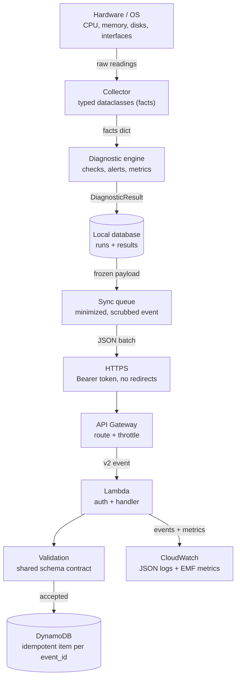
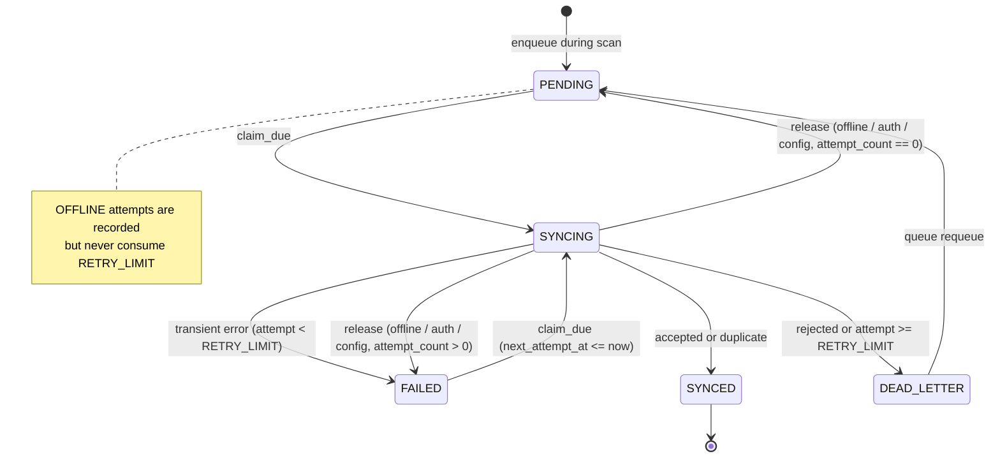

# Architecture

> Language: English · [Português (Brasil)](architecture.pt-BR.md)

This document explains the components, the data flow, identity, the local
SQLite schema, the sync state machine, the failure matrix, and the deviations
from the original specification. It is written for a developer who did not build
the project.

## Overview

The repository holds three Python packages under `src/`:

- `agent` — the Windows edge agent (collectors, diagnostics, storage, sync, CLI).
- `cloud` — the AWS Lambda handlers and the DynamoDB repository.
- `shared` — stdlib-only models, payload validators, and ID/time/JSON-logging
  utilities used by both sides.

The agent pipeline is `collect → diagnose → evaluate → persist (+ enqueue) →
report`. Sync is a separate, optional step that reads the queue. The cloud side
is four small Lambda functions behind an HTTP API, sharing one code bundle but
each with its own IAM role. The shared validator is the API contract: the cloud
enforces it and the agent pre-checks every outgoing event with the same code.

## Data flow

What data exists at each stage:

- **Hardware / OS**: raw readings via `psutil` and read-only PowerShell CIM
  queries (GPU, gateways, DNS, physical-disk health).
- **Collector**: typed dataclasses (`CpuInfo`, `MemoryInfo`, `VolumeInfo`,
  `SystemInfo`, `NetworkInfo`, ...). The rich local observation is kept in the
  result's `facts` and is never uploaded wholesale.
- **Diagnostic engine**: deterministic rules produce `Check`, `Alert` and
  `Metric` objects plus an overall `HealthStatus` and a `NetworkStatus`.
- **Local database**: one `diagnostic_runs` row, its `diagnostic_results` rows,
  and (when sync is enabled) one `sync_queue` row, written in a single
  transaction.
- **Sync queue**: a frozen, minimized and IP-scrubbed telemetry payload so
  retries send byte-identical JSON.
- **HTTPS**: a JSON batch with a Bearer token; redirects are refused.
- **API Gateway**: routes and throttles, writes an access log.
- **Lambda**: authenticates, validates, and writes to DynamoDB.
- **Validation**: the shared schema; invalid events are rejected per item.
- **DynamoDB**: exactly one item per `event_id` (idempotent).
- **CloudWatch**: structured JSON logs and EMF custom metrics.

## Component reference

### Python components

| Component | What it is | Collects / processes | Depends on | If it fails |
|---|---|---|---|---|
| `agent.main` / `commands` | CLI entry and thin orchestration | parses args, maps exit codes | `argparse` | prints a message, exits 1/2 |
| `agent.pipeline` | runs collect→diagnose→evaluate→persist | builds a `DiagnosticResult` | collectors, diagnostics, storage | storage error exits 1, report still printed |
| `agent.collectors.*` | per-domain readers | CPU, memory, storage, system, network, GPU/disk | `psutil`, platform module | section marked FAILED/UNAVAILABLE, run continues |
| `agent.platform_support` | read-only Windows CIM via PowerShell | GPU, gateways, DNS, disk health | `subprocess` + PowerShell | `PlatformQueryError`, field unavailable |
| `agent.diagnostics.probes` | ping / TCP connect / DNS | reachability and latency | `subprocess`, sockets | ERROR outcome → UNKNOWN/SKIPPED, not a crash |
| `agent.diagnostics.rules` / `health` | deterministic thresholds | checks, alerts, overall status | config `Thresholds` | missing input → SKIPPED check |
| `agent.storage.local_db` | SQLite connection + migrations | atomic run persistence | `sqlite3` | `StorageError`, exit 1 |
| `agent.storage.queue` | sync-queue state machine | owns every state transition | `sqlite3` | invalid transition logged ERROR |
| `agent.sync.client` | transport + ordered response classification | registration, telemetry | `urllib` | typed errors, never a leak |
| `agent.sync.service` | one bounded sync cycle | registration, batching, transitions | queue, client, backoff | errors are reported, never crash the run |
| `shared.schemas.*` | the API contract validators | validate envelope/event/registration | stdlib | returns issues (never raises) |

### AWS components

For each: what it is, why this project uses it, the problem it solves, what
happens if it fails, cost, and permissions.

- **HTTP API Gateway** — the public HTTPS entry point. Chosen over REST API for
  lower cost and latency on a simple JSON API. Terminates TLS, routes to the
  four functions, throttles, and writes an access log. If it fails, the agent
  cannot reach the backend and events stay queued. Cost: per million requests.
  Needs permission to write to the access-log group (service-linked role for
  `ops.apigateway.amazonaws.com`).
- **Lambda (health, device, telemetry, diagnostic)** — stateless compute per
  route. Chosen because the workload is spiky and tiny; no servers to run.
  Solves "run my code on request without managing capacity". If a function
  errors, the client sees a 5xx and the agent retries; events are preserved
  locally. Cost: per request + GB-second (128 MB, `arm64`). Each has its own
  role: logs plus the minimal DynamoDB and SSM actions it needs.
- **DynamoDB** — the single-table store for device profiles and diagnostic
  events. Chosen for serverless, pay-per-request storage with predictable
  key-based access and a TTL. Solves durable, idempotent event storage. If it
  throttles or is unavailable, handlers return 503 and the agent retries. Cost:
  on-demand read/write units + storage; TTL expiry is free. Needs
  `GetItem`/`PutItem`/`UpdateItem`/`Query` on the table and GSI only.
- **SSM Parameter Store (SecureString)** — holds the two API keys. Chosen over
  Secrets Manager because Parameter Store SecureStrings are free for standard
  parameters. If decryption is denied the function returns 503. Needs
  `ssm:GetParameters` on exactly the two parameter ARNs plus KMS decrypt via the
  managed `alias/aws/ssm` key.
- **CloudWatch Logs + EMF metrics** — observability. Chosen because Lambda ships
  logs there automatically and EMF turns a log line into a metric with no extra
  API call. If logging fails the request still completes. Cost: ingestion +
  storage (14-day retention) and per custom metric name × dimension.

## Identity

The device identity is a random UUIDv4 generated on first run and stored in the
`devices` table with `is_local = 1`; the hostname is a stored attribute, never
the key, so the identity is independent of IP and hardware serials. A `DEVICE_ID`
override is stored with `is_local = 0`. A partial unique index
(`idx_devices_single_local`) guarantees at most one local identity. Read-only
commands never create an identity. The identity is stable across runs and
unchanged when the IP changes.

## Local SQLite schema

WAL mode, foreign keys on, `PRAGMA user_version` for migrations and
`PRAGMA application_id` to mark live vs demo databases.

- `devices(device_id PK, device_name, hostname, is_local, created_at,
  registration_fingerprint, registered_at)` — one local identity enforced by a
  partial unique index.
- `diagnostic_runs(run_id PK, device_id FK, source, scenario, started_at,
  finished_at, status, network_status, result_json)`.
- `diagnostic_results(id PK, run_id FK, result_type ∈ {check,alert,metric},
  name, status, value, unit, subject, details_json)`.
- `sync_queue(event_id PK, run_id UNIQUE FK, device_id FK, event_type,
  payload_json, state, attempt_count, next_attempt_at, claimed_at, last_error,
  created_at, updated_at, synced_at)`.
- `sync_attempts(id PK, event_id FK, attempted_at, outcome, http_status,
  error_code, error_message, duration_ms, request_id)`.

Read-only commands (`hardware`, `network`, `health`, `status`, `queue list` /
`stats`) open a `mode=ro` URI, never migrate and never change a PRAGMA; an
outdated schema raises `SchemaOutdatedError`.

## Sync state machine

Bounded retry bounds delivery attempts that reached (or may have reached) the
API. A cycle in which the API host cannot be reached at all is recorded as an
`OFFLINE` attempt but does not consume `RETRY_LIMIT`, because being offline is
the normal condition the product exists for. The bound on aggressiveness during
an outage comes from the cycle cadence (one connection attempt per cycle, no
in-process retry loop), not from the retry counter. Delays use exponential
backoff with jitter: `min(max_s, base_s · 2^(attempt-1)) · uniform(0.5, 1.0)`.

A crashed agent leaves rows in `SYNCING`; the next cycle recovers leases older
than `SYNC_LEASE_SECONDS` as an `INTERRUPTED` attempt (counted, because the
request may have been delivered) and moves them on through the fail rule.

## Failure matrix

| Failure | Detected by | Behavior | Where visible |
|---|---|---|---|
| Collector exception / WMI unavailable | `run_collector` | section FAILED/UNAVAILABLE, run continues, INFO alert | report, local log |
| PowerShell timeout | `run_powershell_json` | `PlatformQueryError` → field unavailable | report, local log WARNING |
| Internet unavailable | probes | OFFLINE + INTERNET_CONNECTIVITY_FAILURE or LOCAL_NETWORK_FAILURE; event queued | report, queue |
| Probes cannot execute | probes (ERROR) | network UNKNOWN, connectivity checks SKIPPED | report, local log |
| DNS unavailable | resolve probes | DNS_FAILURE (if internet up) | report |
| No connectivity to API | `UrllibTransport` → `ConnectivityError` | cycle aborted after one request; events stay PENDING/FAILED, count unchanged; OFFLINE attempt rows; resumes automatically | `queue`, `sync_attempts`, log WARNING `sync_offline` |
| API reached but failed (5xx / 429 / response timeout / reset after send) | `ApiClient` | FAILED with backoff, DEAD_LETTER at `RETRY_LIMIT` | `queue`, `sync_attempts`, log |
| Malformed response | `ApiClient` | transient FAILED | same |
| Redirect / unexpected status | `ApiClient` | CONFIG_ERROR, cycle aborted, count unchanged, key never sent to redirect target | CLI exit 3, log ERROR |
| Agent clock ahead of server | cloud `CLOCK_SKEW` item | transient for that event, WARNING `clock_skew` | local log, `sync_attempts` |
| Invalid credentials | 401/403 | cycle aborted, attempts not consumed, exit 3 | CLI, log ERROR; CloudWatch AuthFailure |
| Lambda unexpected error | `@api_handler` | 500, event preserved and retried | CloudWatch + LambdaError metric |
| DynamoDB throttling/unavailable | repository | 503 → agent retries | CloudWatch DynamoDBError; local queue |
| Invalid payload | shared validators | 400 / item rejected → DEAD_LETTER | API response, CloudWatch ValidationError |
| Duplicate event | conditional put | `duplicate` → SYNCED, one item stored | response, TelemetryDuplicate |
| event_id reuse with different payload | hash compare | `EVENT_ID_CONFLICT` → DEAD_LETTER | response, local queue |
| Retry exhaustion | queue | DEAD_LETTER, manual `queue requeue` | `queue stats`, log ERROR |
| Local DB locked/corrupt | sqlite3 | StorageError, exit 1, report still printed | CLI, local log |
| Agent crash mid-sync | lease recovery | SYNCING → INTERRUPTED attempt → FAILED | `sync_attempts` |

## Deviations from the specification (§8)

- `platform_support/` is added for the Windows-specific, read-only queries; it is
  named to avoid confusion with the stdlib `platform` module.
- `pipeline.py`, `commands.py`, `identity.py`, `report.py`, `demo.py`,
  `diagnostics/probes.py` and `sync/service.py` are added to keep `main.py` thin
  and every unit testable.
- `src/cloud/` is added for the Lambda handlers and repository.
- Tests live at the repository root under `tests/` rather than `src/tests`.
- The reusable JSON log formatter lives in `shared/utils/json_logging.py`
  because the cloud needs it too.

An import-boundary test (AST scan) enforces that `shared` imports stdlib only,
`cloud` imports `shared`/stdlib/boto3 only, and `agent` never imports `cloud`,
so the SAM bundle never pulls in `psutil`-dependent agent code.

## A note on packet loss / TCP probe failure rate

The agent does not use raw ICMP for its loss metric. The `network.packet_loss`
check reports the **TCP probe failure rate**: the fraction of controlled TCP
connect probes to the configured internet targets that did not get a reply. The
field keeps its specification name ("packet loss") but should be read as a
probe-failure rate, which is why it never requires administrator rights.
