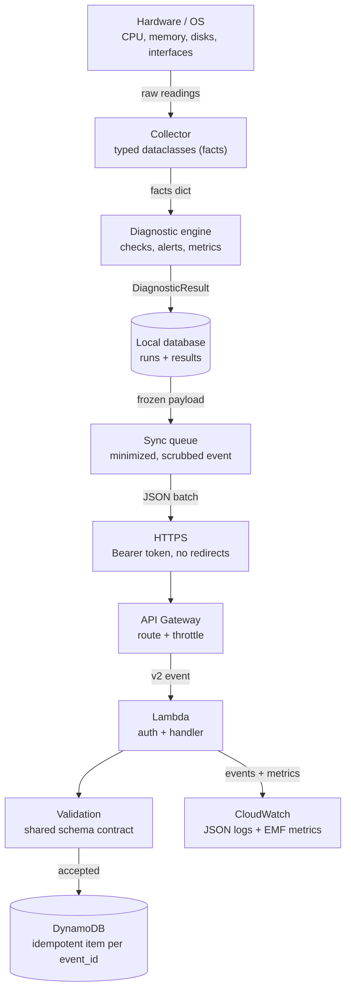
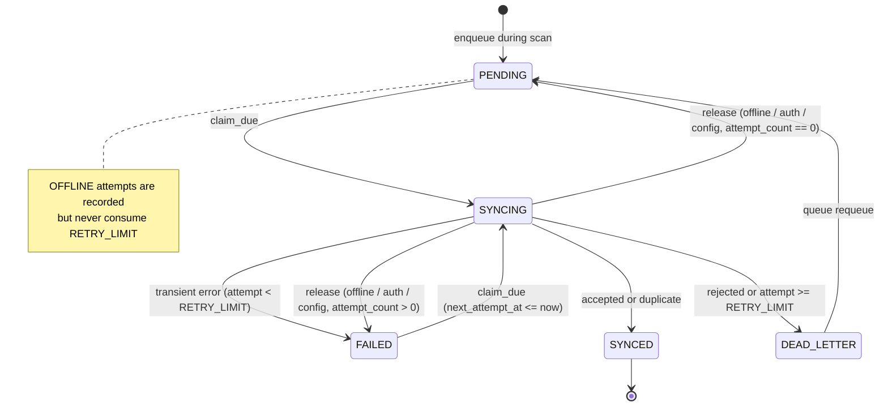

# Arquitetura

> Idioma: Português (Brasil) · [English](architecture.md)

Este documento explica os componentes, o fluxo de dados, a identidade, o schema
local em SQLite, a máquina de estados da sincronização, a matriz de falhas e os
desvios em relação à especificação original. É escrito para uma pessoa
desenvolvedora que não construiu o projeto.

## Visão geral

O repositório contém três pacotes Python em `src/`:

- `agent` — o agente de borda para Windows (coletores, diagnósticos,
  armazenamento, sincronização, CLI).
- `cloud` — os handlers Lambda da AWS e o repositório do DynamoDB.
- `shared` — modelos somente-stdlib, validadores de payload e utilitários de
  ID/tempo/log-JSON usados pelos dois lados.

O pipeline do agente é `collect → diagnose → evaluate → persist (+ enqueue) →
report`. A sincronização é um passo separado e opcional que lê a fila. O lado da
nuvem são quatro funções Lambda pequenas atrás de um HTTP API, compartilhando um
único pacote de código, mas cada uma com sua própria role IAM. O validador
compartilhado é o contrato da API: a nuvem o impõe e o agente pré-verifica cada
evento de saída com o mesmo código.

## Fluxo de dados

Quais dados existem em cada estágio:

- **Hardware / OS**: leituras brutas via `psutil` e consultas CIM somente leitura
  do PowerShell (GPU, gateways, DNS, saúde do disco físico).
- **Collector**: dataclasses tipadas (`CpuInfo`, `MemoryInfo`, `VolumeInfo`,
  `SystemInfo`, `NetworkInfo`, ...). A observação local rica fica nos `facts` do
  resultado e nunca é enviada por inteiro.
- **Diagnostic engine**: regras determinísticas produzem objetos `Check`,
  `Alert` e `Metric`, além de um `HealthStatus` geral e um `NetworkStatus`.
- **Local database**: uma linha `diagnostic_runs`, suas linhas
  `diagnostic_results` e (quando a sincronização está ativa) uma linha
  `sync_queue`, escritas em uma única transação.
- **Sync queue**: um payload de telemetria congelado, minimizado e com IPs
  removidos, para que as retentativas enviem JSON byte-a-byte idêntico.
- **HTTPS**: um lote JSON com um token Bearer; redirecionamentos são recusados.
- **API Gateway**: roteia e aplica throttling, escreve um log de acesso.
- **Lambda**: autentica, valida e escreve no DynamoDB.
- **Validation**: o schema compartilhado; eventos inválidos são rejeitados por
  item.
- **DynamoDB**: exatamente um item por `event_id` (idempotente).
- **CloudWatch**: logs JSON estruturados e métricas customizadas EMF.

## Referência de componentes

### Componentes Python

| Componente | O que é | Coleta / processa | Depende de | Se falhar |
|---|---|---|---|---|
| `agent.main` / `commands` | entrada da CLI e orquestração fina | parseia args, mapeia exit codes | `argparse` | imprime mensagem, sai 1/2 |
| `agent.pipeline` | roda collect→diagnose→evaluate→persist | constrói um `DiagnosticResult` | coletores, diagnósticos, storage | erro de storage sai 1, relatório ainda impresso |
| `agent.collectors.*` | leitores por domínio | CPU, memória, armazenamento, sistema, rede, GPU/disco | `psutil`, módulo de plataforma | seção FAILED/UNAVAILABLE, execução continua |
| `agent.platform_support` | CIM do Windows somente leitura via PowerShell | GPU, gateways, DNS, saúde do disco | `subprocess` + PowerShell | `PlatformQueryError`, campo indisponível |
| `agent.diagnostics.probes` | ping / TCP connect / DNS | alcançabilidade e latência | `subprocess`, sockets | resultado ERROR → UNKNOWN/SKIPPED, não quebra |
| `agent.diagnostics.rules` / `health` | limiares determinísticos | checks, alerts, status geral | `Thresholds` da config | entrada ausente → check SKIPPED |
| `agent.storage.local_db` | conexão SQLite + migrações | persistência atômica da execução | `sqlite3` | `StorageError`, sai 1 |
| `agent.storage.queue` | máquina de estados da fila | é dona de toda transição de estado | `sqlite3` | transição inválida logada ERROR |
| `agent.sync.client` | transporte + classificação ordenada da resposta | registro, telemetria | `urllib` | erros tipados, nunca um vazamento |
| `agent.sync.service` | um ciclo de sincronização limitado | registro, lotes, transições | fila, cliente, backoff | erros reportados, nunca quebram a execução |
| `shared.schemas.*` | os validadores do contrato da API | validam envelope/evento/registro | stdlib | retornam issues (nunca lançam) |

### Componentes AWS

Para cada um: o que é, por que o projeto o usa, o problema que resolve, o que
acontece se falhar, custo e permissões.

- **HTTP API Gateway** — o ponto de entrada HTTPS público. Escolhido em vez do
  REST API por custo e latência menores em uma API JSON simples. Termina TLS,
  roteia para as quatro funções, aplica throttling e escreve um log de acesso. Se
  falhar, o agente não alcança o backend e os eventos ficam enfileirados. Custo:
  por milhão de requisições. Precisa de permissão para escrever no grupo de logs
  de acesso (service-linked role para `ops.apigateway.amazonaws.com`).
- **Lambda (health, device, telemetry, diagnostic)** — computação sem estado por
  rota. Escolhida porque a carga é esporádica e minúscula; sem servidores para
  rodar. Resolve "rode meu código sob demanda sem gerenciar capacidade". Se uma
  função dá erro, o cliente vê um 5xx e o agente tenta de novo; os eventos ficam
  preservados localmente. Custo: por requisição + GB-segundo (128 MB, `arm64`).
  Cada uma tem sua role: logs mais as ações mínimas de DynamoDB e SSM.
- **DynamoDB** — o armazenamento de tabela única para perfis de dispositivo e
  eventos de diagnóstico. Escolhido por armazenamento serverless pay-per-request
  com acesso previsível por chave e um TTL. Resolve armazenamento durável e
  idempotente de eventos. Se sofre throttling ou fica indisponível, os handlers
  retornam 503 e o agente tenta de novo. Custo: unidades de leitura/escrita sob
  demanda + armazenamento; a expiração por TTL é gratuita. Precisa apenas de
  `GetItem`/`PutItem`/`UpdateItem`/`Query` na tabela e no GSI.
- **SSM Parameter Store (SecureString)** — guarda as duas chaves de API.
  Escolhido em vez do Secrets Manager porque SecureStrings padrão do Parameter
  Store são gratuitas. Se a descriptografia for negada, a função retorna 503.
  Precisa de `ssm:GetParameters` exatamente nos dois ARNs de parâmetro mais o
  decrypt do KMS pela chave gerenciada `alias/aws/ssm`.
- **CloudWatch Logs + métricas EMF** — observabilidade. Escolhido porque o Lambda
  envia logs para lá automaticamente e o EMF transforma uma linha de log em
  métrica sem chamada de API extra. Se o log falhar, a requisição ainda termina.
  Custo: ingestão + armazenamento (retenção de 14 dias) e por métrica
  customizada por nome × dimensão.

## Identidade

A identidade do dispositivo é um UUIDv4 aleatório gerado na primeira execução e
armazenado na tabela `devices` com `is_local = 1`; o hostname é um atributo
armazenado, nunca a chave, de modo que a identidade é independente de IP e de
números de série de hardware. Um override `DEVICE_ID` é armazenado com
`is_local = 0`. Um índice único parcial (`idx_devices_single_local`) garante no
máximo uma identidade local. Comandos somente leitura nunca criam identidade. A
identidade é estável entre execuções e inalterada quando o IP muda.

## Schema local do SQLite

Modo WAL, foreign keys ativas, `PRAGMA user_version` para migrações e
`PRAGMA application_id` para marcar bancos live vs demo.

- `devices(device_id PK, device_name, hostname, is_local, created_at,
  registration_fingerprint, registered_at)` — uma identidade local imposta por um
  índice único parcial.
- `diagnostic_runs(run_id PK, device_id FK, source, scenario, started_at,
  finished_at, status, network_status, result_json)`.
- `diagnostic_results(id PK, run_id FK, result_type ∈ {check,alert,metric},
  name, status, value, unit, subject, details_json)`.
- `sync_queue(event_id PK, run_id UNIQUE FK, device_id FK, event_type,
  payload_json, state, attempt_count, next_attempt_at, claimed_at, last_error,
  created_at, updated_at, synced_at)`.
- `sync_attempts(id PK, event_id FK, attempted_at, outcome, http_status,
  error_code, error_message, duration_ms, request_id)`.

Comandos somente leitura (`hardware`, `network`, `health`, `status`, `queue list`
/ `stats`) abrem uma URI `mode=ro`, nunca migram e nunca mudam um PRAGMA; um
schema desatualizado lança `SchemaOutdatedError`.

## Máquina de estados da sincronização

A retentativa limitada limita as tentativas de entrega que alcançaram (ou podem
ter alcançado) a API. Um ciclo em que o host da API não pode ser alcançado é
registrado como uma tentativa `OFFLINE`, mas não consome `RETRY_LIMIT`, porque
estar offline é a condição normal para a qual o produto existe. O limite da
agressividade durante uma queda vem da cadência do ciclo (uma tentativa de
conexão por ciclo, sem laço de retentativa dentro do processo), não do contador
de retentativas. Os atrasos usam backoff exponencial com jitter:
`min(max_s, base_s · 2^(attempt-1)) · uniform(0.5, 1.0)`.

Um agente que travou deixa linhas em `SYNCING`; o próximo ciclo recupera leases
mais antigos que `SYNC_LEASE_SECONDS` como uma tentativa `INTERRUPTED` (contada,
porque a requisição pode ter sido entregue) e as segue pela regra de falha.

## Matriz de falhas

| Falha | Detectada por | Comportamento | Onde é visível |
|---|---|---|---|
| Exceção de coletor / WMI indisponível | `run_collector` | seção FAILED/UNAVAILABLE, execução continua, alerta INFO | relatório, log local |
| Timeout do PowerShell | `run_powershell_json` | `PlatformQueryError` → campo indisponível | relatório, log local WARNING |
| Internet indisponível | probes | OFFLINE + INTERNET_CONNECTIVITY_FAILURE ou LOCAL_NETWORK_FAILURE; evento enfileirado | relatório, fila |
| Probes não podem executar | probes (ERROR) | rede UNKNOWN, checks de conectividade SKIPPED | relatório, log local |
| DNS indisponível | probes de resolução | DNS_FAILURE (se internet ok) | relatório |
| Sem conectividade com a API | `UrllibTransport` → `ConnectivityError` | ciclo abortado após uma requisição; eventos ficam PENDING/FAILED, contagem inalterada; linhas de tentativa OFFLINE; retoma automaticamente | `queue`, `sync_attempts`, log WARNING `sync_offline` |
| API alcançada mas falhou (5xx / 429 / timeout de resposta / reset após envio) | `ApiClient` | FAILED com backoff, DEAD_LETTER em `RETRY_LIMIT` | `queue`, `sync_attempts`, log |
| Resposta malformada | `ApiClient` | FAILED transitório | idem |
| Redirecionamento / status inesperado | `ApiClient` | CONFIG_ERROR, ciclo abortado, contagem inalterada, chave nunca enviada ao destino | CLI exit 3, log ERROR |
| Relógio do agente adiantado | item `CLOCK_SKEW` da nuvem | transitório para aquele evento, WARNING `clock_skew` | log local, `sync_attempts` |
| Credenciais inválidas | 401/403 | ciclo abortado, tentativas não consumidas, exit 3 | CLI, log ERROR; CloudWatch AuthFailure |
| Erro inesperado no Lambda | `@api_handler` | 500, evento preservado e retentado | CloudWatch + métrica LambdaError |
| Throttling/indisponibilidade do DynamoDB | repository | 503 → agente tenta de novo | CloudWatch DynamoDBError; fila local |
| Payload inválido | validadores compartilhados | 400 / item rejeitado → DEAD_LETTER | resposta da API, CloudWatch ValidationError |
| Evento duplicado | put condicional | `duplicate` → SYNCED, um item armazenado | resposta, TelemetryDuplicate |
| Reuso de event_id com payload diferente | comparação de hash | `EVENT_ID_CONFLICT` → DEAD_LETTER | resposta, fila local |
| Esgotamento de retentativas | fila | DEAD_LETTER, `queue requeue` manual | `queue stats`, log ERROR |
| Banco local travado/corrompido | sqlite3 | StorageError, exit 1, relatório ainda impresso | CLI, log local |
| Agente trava no meio da sincronização | recuperação de lease | SYNCING → tentativa INTERRUPTED → FAILED | `sync_attempts` |

## Desvios em relação à especificação (§8)

- `platform_support/` é adicionado para as consultas específicas do Windows,
  somente leitura; nomeado para evitar confusão com o módulo `platform` da stdlib.
- `pipeline.py`, `commands.py`, `identity.py`, `report.py`, `demo.py`,
  `diagnostics/probes.py` e `sync/service.py` são adicionados para manter
  `main.py` enxuto e tudo testável por unidade.
- `src/cloud/` é adicionado para os handlers Lambda e o repositório.
- Os testes ficam na raiz do repositório em `tests/`, não em `src/tests`.
- O formatador reutilizável de log JSON fica em `shared/utils/json_logging.py`
  porque a nuvem também precisa dele.

Um teste de fronteira de import (varredura por AST) garante que `shared` importe
apenas stdlib, `cloud` importe apenas `shared`/stdlib/boto3 e `agent` nunca
importe `cloud`, de modo que o pacote do SAM nunca puxe código do agente que
depende de `psutil`.

## Nota sobre perda de pacotes / taxa de falha de probes TCP

O agente não usa ICMP bruto para sua métrica de perda. O check
`network.packet_loss` reporta a **taxa de falha de probes TCP**: a fração de
probes TCP controlados aos alvos de internet configurados que não obtiveram
resposta. O campo mantém o nome da especificação ("packet loss"), mas deve ser
lido como taxa de falha de probes, por isso nunca exige privilégios de
administrador.
